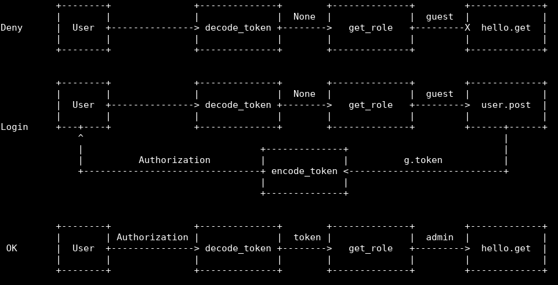
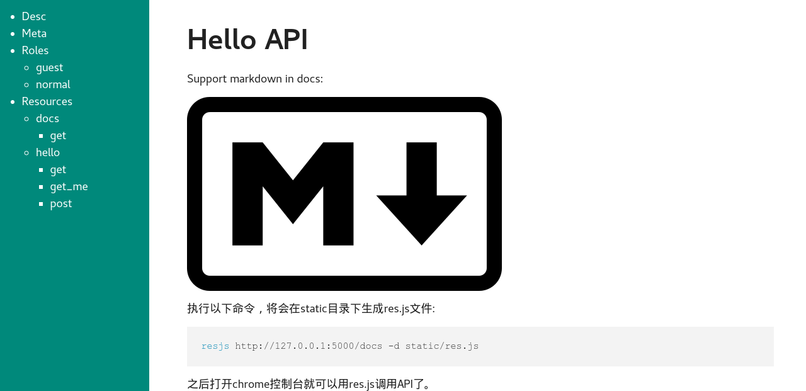

# Quick Start

## Welcome

    from flask import Flask
    from flask_restaction import Api

    app = Flask(__name__)
    api = Api(app)

    class Welcome:

        def __init__(self, name):
            self.name = name
            self.message = "Hello %s, Welcome to flask-restaction!" % name

    # create a resource
    class Hello:
        """Hello world"""

        # create an action
        def get(self, name):
            """
            Get welcome message

            $input:
                name?str&default="world": Your name
            $output:
                message?str: Welcome message
            """
            return Welcome(name)

    api.add_resource(Hello)
    # config route of API document
    app.route('/')(api.meta_view)

    if __name__ == '__main__':
        app.run(debug=True)

Save as `hello.py`, then run it:

    $ python hello.py
     * Running on http://127.0.0.1:5000/
     * Restarting with reloader

Visit http://127.0.0.1:5000/hello:

    {
      "message": "Hello world, Welcome to flask-restaction!"
    }

Visit http://127.0.0.1:5000/hello?name=kk

you will see:

    {
      "message": "Hello kk, Welcome to flask-restaction!"
    }

Visit http://127.0.0.1:5000 for generated API document.

#### Two concept

resource
:   eg: class Hello, represent a kind of resource

action
:   eg: get, post, delete, get_list, post_login. HTTP method + '_' + anything is OK.

## Validation and Serialization

Use `$shared` to describe shared schema in doc string and register it via
`Api(docs=__doc__)` .

Use `$shared` in resource's doc string to describe shared schema for resource.

In action's doc string, use `$input`, `$output` to describe request and response
data struct, use `$error` to describe exceptions.

$input
:   Request data struct, if no $input, then won't validate request data and
    call action without params.
    If HTTP method is GET,DELETE, request data is query string. If HTTP method
    is POST,PUT,PATCH, request data is request body, and Content-Type should
    be application/json.
    
$output
:   Response data struce, if no $output, then won't validate and serialize
    returns value of action.

$error
:   Describe exceptions, only used for API document, eg:

        $error:
            400.InvalidData: invalid request data
            403.PermissionDeny: permission deny

    Syntax is: status.Error: message

If request data validation fail, then response is:

    {
        "status": 400,
        "error": "InvalidData",
        "message": "xxx xxxx"
    }

If response data validation fail, then response is:

    {
        "status": 500,
        "error": "ServerError",
        "message": "xxx xxxx"
    }

Schema is [YAML](https://zh.wikipedia.org/wiki/YAML) text, see [Schema](schema.md).

### Custom validator

Validr's document had describe custom validator, see [Validr](https://github.com/guyskk/validr).

All custom validators is registered via `Api(validators=validators)`.

## Add resource

Use `Api.add_resource` to add resource, params of `add_resource` will
be passed to resource's `__init__` method.

URL is the same as resource name, if you want to use another URL, you can
create a new resource like this:

    api.add_resource(type('NewName', (MyResource,), {}))

## URL rules

use `url_for(endpoint)` of flask to build url for action.

endpoint is `resource@action_name`

resource
:   resource classname in lowercase

action_name
:   the last part of action(split via '_')

Usage:

    url_for("resource@action_name") -> /resource/action_name

Example:

    url_for("hello") -> /hello
    url_for("hello@login") -> /hello/login

## Response errors

    from flask_restaction import abort

    # function prototype
    abort(code, error=None, message=None)

If param error is None, the effect is the same as `flask.abort(code)`.
If error is instance of `flask.Response`, the effect is the same as `flask.abort(code, error)`.

Otherwise, response:

    {
        "status": code,
        "error": error,
        "message": message
    }

The response data will be serialized to appropriate format.

## Permission control

The authorization implement is for convenient in many projects which
didn't need too flex permission system. You can use flask-login and others,
they works well with flask-restaction.

### Let's begin with a example

meta.json, config roles

    {
        "$roles": {
            "admin": {
                "hello": ["get", "post"],
                "user": ["post"]
            },
            "guest": {
                "user": ["post"]
            }
        }
    }

__init__.py, decide role according to token

    from flask_restaction import Api, TokenAuth

    api = Api(metafile='meta.json')
    auth = TokenAuth(api)

    @auth.get_role
    def get_role(token):
        if token:
            return token["role"]
        else:
            return "guest"

hello.py, business logic

    class Hello:

        def get(self):
            pass

        def post(self):
            pass

user.py, login API

    from flask import g

    class User:

        def __init__(self, api):
            self.api = api

        def post(self, username, password):
            # query user from database
            g.token = {"id": user.id, "role": user.role}
            return user

### Context of Use

The user request `hello.get` firsthand, when framwork receive the request,
it will take `token` from `Authorization` headers, 
`token` is `None`, then framwork call `get_role(None)`, and gets `guest` , 
then see if `get` in `meta["$roles"]["guest"]["hello"]`, the anwser is not, 
so the framwork reject this request.

Then the user request `user.post`, the process is same as above, 
the request arrive at `user.post`, then check username and password, 
if success, set `g.token` which contains user ID, role, and expiration time.
TokenAuth will encode `g.token` by JWT, then send it to client through `Authorization`.

The user request `hello.get` again, and set request headers `Authorization` to 
the `token`, the process is same as above, the request arrive at `hello.get`.

### Diagram

### Step by Step

#### 1. Config roles in metafile

metafile is a file contains meta data of API, generally placed inside
app's root path and filename is meta.json.

Api load metafile by `Api(metafile="meta.json")`:

    {
        "$roles": {
            "Role": {
                "Resource": ["Action", ...]
            }
        }
    }

When request arrived, the framwork can decide accept the request or not
according to Role, Resource, Action rapidly.

!!! note
    Flask's Development Server can't auto reload if metafile changed, so you
    should restart app manaually if modified metafile.

#### 2. Register get_role function

Framwork can parse Resource, Action from URL, but it can't known which role the
user is, so it needs you provide a function which can tell user's role.

#### 3. Generate token

In order to identity users, the framwork should generate a token and send it
to client by response headers(`Authorization`).

The token will contains user ID and expiration time. The client should take
token in request headers.

TokenAuth use [json web token](https://github.com/jpadilla/pyjwt) for Authorization.

!!! note
    Token will be encode use app.secret_key, so it can't be tampered.    
    You should set app.secret_key before encode token.    
    Token is unencrypted, don't put sensitive information in it.    

If authorization failed, the response is:

    {
        "status": 403,
        "error": "PermissionDeny",
        "message": "xxx can't access xxxx"
    }

#### Security and Configs

Different security requirements, authorize implementation will be different, 
TokenAuth implementations suitable for less demanding security applications.

When the token is about to expire, server will issue a new token to the client, 
so to avoid token expires cause interruptions of normal use by users. 

But it can also lead to infinitely refreshed token which has some security risks.

Here is default configs:

    {
        "$auth": {
              "algorithm": "HS256",     # token's encode algorithm
              "expiration": 3600,       # token's time to live, in seconds
              "header": "Authorization" # request/response header for token
              "cookie": null            # cookie name for token, default not use cookie
              "refresh": true           # auto refresh token or not
        }
    }

#### Custom Auth

`Api.authorize(role)` can decide permit or reject request according to request
URL and `$roles`, you can simplify custom auth by utilize this method. 

Here is the basic structure, see 
[flask_restaction/auth.py](https://github.com/guyskk/flask-restaction) for more:

    class MyAuth:

        def __init__(self, api):
            self.api = api
            self.config = api.meta["$auth"]
            api.before_request(self.before_request)
            api.after_request(self.after_request)

        def before_request(self):
            """Parse request, check permission"""
            # parse role from request
            self.api.authorize(role)

        def after_request(self, rv, status, headers):
            """Modify response"""
            return rv, status, headers

## API document

There are two ways to config route for API document.

### Flask.route
    
    app.route('/')(api.meta_view)

### Api.add_resource

This way will treat document as a resource, and is easy for permission control.

    # Note: enable token via cookie
    {
        "$auth": {
              "cookie": "Authorization"
        }
    }
    # add_resource
    api.add_resource(type('Docs', (), {'get': api.meta_view}))

Api.meta_view can also response API meta data in JSON format, set request
header `Accept` to `application/json` to do so.

## Blueprint

Api can exist inside blueprint, then all resources will be routed in blueprint.

    from flask import Flask, Blueprint
    from flask_restaction import Api

    app = Flask(__name__)
    bp = Blueprint('api', __name__)
    api = Api(bp)
    api.add_resource(XXX)
    app.register_blueprint(bp)

!!! note
    add_resource should call before register_blueprint, otherwise
    add_resource has no effect.

## Event handler

Api provide before_request, after_request, error_handler decorater for register
event handlers.

    @api.before_request
    def before_request():
        # this function will be called before action exec
        # if return value is not None, then use it as response
        return response

    @api.after_request
    def after_request(rv, status, headers):
        # this function is used for process return value of action
        return rv, status, headers

    @api.error_handler
    def error_handler(ex):
        # handle exception raised from before_request and action
        # if return value is not None, then use it as response
        return response

## Custom response format

The dafault response format is JSON, you can add custom response format easily.

    from flask import make_response
    from flask_restaction import exporter

    @exporter('text/html')
    def export_text(data, status, headers):
        return make_response(str(data), status, headers)

The framwork will choose appropriate response format according to the Accept
value in request headers.

## res.js

You can use res.js via open browser console in API document page.

If API's url prefix isn't '/', then you need config **API_URL_PREFIX**.

Example: `http://127.0.0.1:5000/api`

    app.config["API_URL_PREFIX"] = "/api"

See [resjs](resjs.md) for more infomation.

## res.py

res.py's usage is similar as res.js, it use
[Requests](https://github.com/kennethreitz/requests) for sending HTTP requests.

    >>> from flask_restaction import Res
    >>> help(Res)
